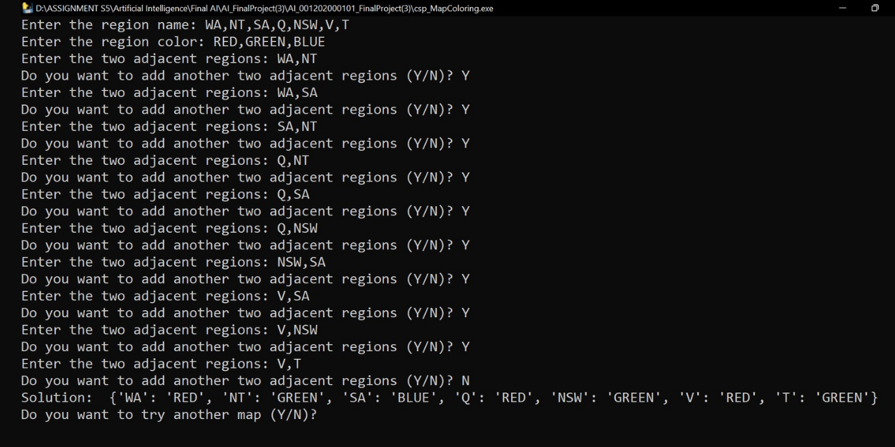

# AI Constraint Satisfaction Problems: Map Coloring with Backtracking-Search using Python Programming Language
This is the final project of the Artificial Intelligence course. In this project, I created an AI Constraint Satisfaction Problems: Map Coloring with Backtracking-Search using Python Programming Language.

A large number of problems that computational tools are used to solve can be broadly categorized as constraint-satisfaction problems (CSPs). CSPs are composed of variables with possible values that fall into ranges known as domains. Constraints between the variables must be satisfied in order for constraint satisfaction problems to be solved. Those three core concepts—variables, domains, and constraints—are simple to understand, and their generality underlies the wide applicability of constraint-satisfaction problem-solving.

For my project, I tried to do a map coloring as the example case of CSP. In the map coloring, all the adjacent regions cannot have the same color so, in my program, with the help of AI using a backtracking-search algorithm, it helps the user to do a map coloring and gain a different color for every adjacent region. In the program, the user needs to input the variables, domains, and constraints. The variables are the regions that need to be colored, the domains are the colors that need to be used to color the region, and the constraints are the two adjacent regions in the map that need to be colored. After all the user input is being inputted, the program will automatically show every region on the map along with its color and every adjacent region will have a different color on the map.

For more detail, you may check the documentation that I attached in the code.

